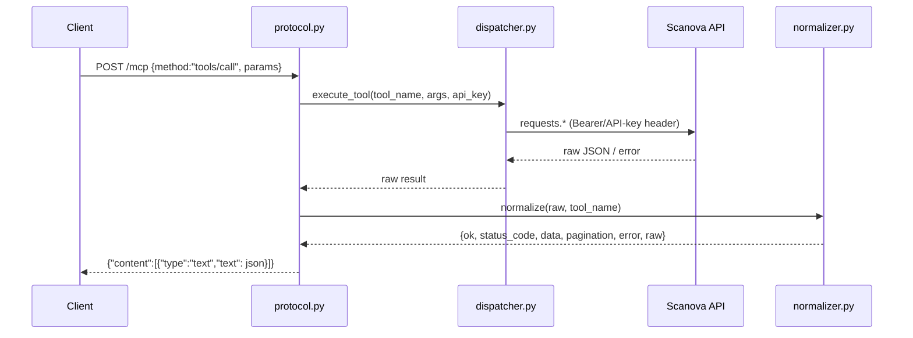
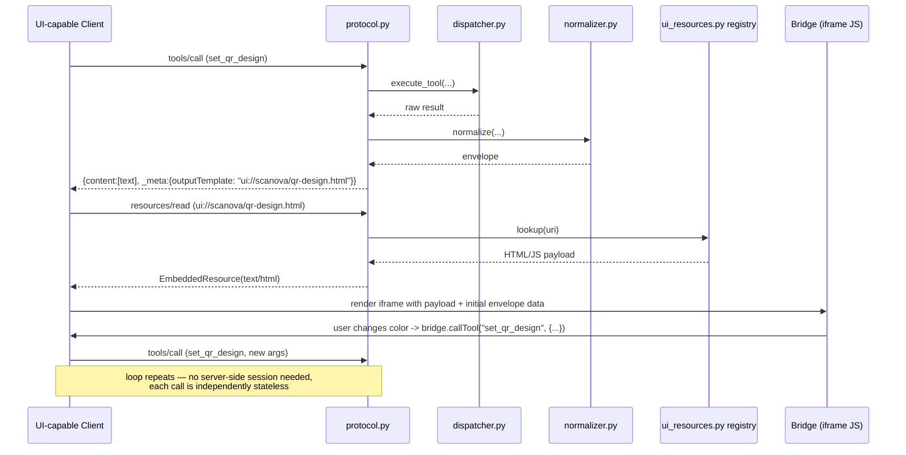
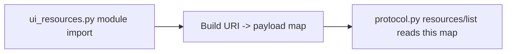
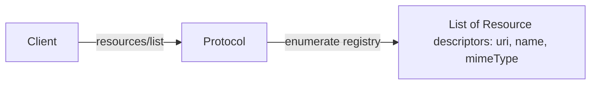
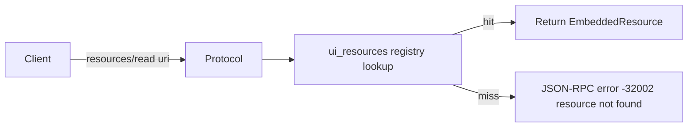
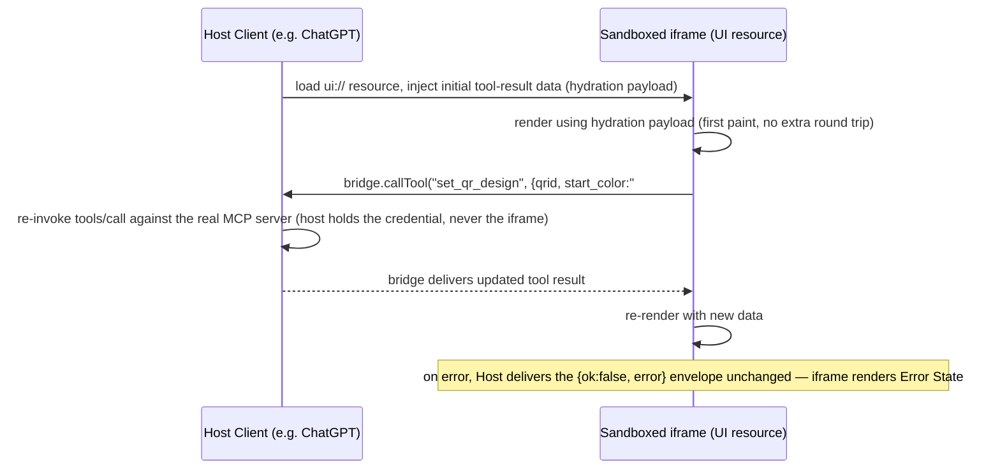

# Scanova MCP — UI Elements Feasibility & Architecture

Status: **v3 — implementation-ready** · Repo: `scanova-mcp` @ `QCG-19750-mcp-add-ui-elements-in-ai`

**v2 → v3 note:** this pass resolves five remaining implementation ambiguities identified as blocking clean implementation, without altering Architecture C, the phased roadmap, the migration/deployment/security strategy, the tool audit, or the UI complexity matrix — all of which are preserved unchanged from v2. Five sections were added: **Part 4A (Layer Ownership Model)**, an expansion of the resource-registry definition inside **Part 7**, **Part 5A (Response Building Abstraction)**, a formal **Bridge Contract** table inside **Part 9**, and **Part 9B (UI Error Model)**. Nothing else in the document was modified.

Classification tags used throughout: **[SPEC]** required by MCP spec, **[CODEBASE]** required by/verified in this repo, **[BEST-PRACTICE]** production best practice, **[OPTIONAL]** optional improvement, **[ASSUMPTION]** not verifiable from the repo — needs your confirmation.

---

## Architecture Review Summary (v1 → v2)

This is a review pass over the v1 report, prompted by a second, more adversarial pass through the installed SDK internals (`mcp/server/fastmcp/server.py`, `mcp/server/lowlevel/server.py`, `mcp/server/auth/*`, `mcp/types.py`). The core finding of v1 — that production runs a hand-rolled JSON-RPC layer, not the SDK dispatcher — **still stands and is unchanged.** What changed is the confidence level around one of v1's implicit assumptions, and the depth of several sections that v1 under-specified.

**New sections added:**
- Specification Compliance Audit (Part 1) — was folded into the compatibility matrix in v1; now separated because it surfaces a real defect (see below).
- SDK Capability Audit (Part 2) — v1 asserted "the SDK has resource types" without enumerating the full capability surface (prompts, sampling, logging, completion, subscriptions, elicitation).
- Architecture Alternatives + Migration Cost Analysis (Parts 3–4) — v1 *assumed* "extend the custom dispatcher" without comparing it to migrating onto the SDK's own HTTP runtime. This assumption is now explicitly tested and only partially upheld.
- Data Flow Diagrams (Part 5), Capability Negotiation (Part 6), Resource Lifecycle (Part 7 — expands old §11), UI Component Architecture (Part 8), Bridge Architecture (Part 9 — expands old §14), Streaming Evaluation (Part 10), Feature Flags & Rollback (Part 12), Observability (Part 13), Operational Readiness (Part 14 — expands old §4/§10), Documentation Strategy (Part 16), Future Roadmap (Part 17) — all net-new, v1 did not cover these.

**Existing sections modified:**
- **Protocol version claim (v1 §2.3)** — corrected. v1 reported the declared protocol version as `"2025-03-26"` without flagging it against the SDK's actual latest. This review found `mcp.types.LATEST_PROTOCOL_VERSION == "2025-06-18"` in the installed `1.12.4` package — `protocol.py` hardcodes a version **one revision behind what the installed SDK itself defines as latest.** This is a **[CODEBASE]**-verified defect, not a style nit: `2025-06-18` is also the revision that introduced `elicitation` and structured-content refinements relevant to UI work. Flagged as a **Critical** fix, folded into Part 1.
- **§7 Frontend stack / §8.2 Required Refactoring** — the "extend `protocol.py` by hand" plan from v1 is retained as the **recommended** path (Architecture A/C hybrid, see Part 3), but v1 stated this with more certainty than the evidence supports. This review found FastMCP's `streamable_http_app()` has a **complete, unused-here auth subsystem** (`mcp.server.auth`: `TokenVerifier`, `BearerAuthBackend`, `stateless_http` setting) that materially lowers the cost of a future full migration (Architecture B). The recommendation is unchanged, but v1's implicit "a full SDK migration would be a rewrite" framing is corrected — it would be substantial, not prohibitive. See Part 3/4 for the actual comparison.
- **§8.5 Security Review** — superseded by the expanded Part 15 (supply chain, SRI, Trusted Types, threat model, checklist). Original mandatory/recommended items are preserved verbatim inside Part 15, not dropped.
- **§5 Tool Audit** — preserved as-is for the "why" narrative, but superseded as the operative reference table by Part 11 (UI Complexity Matrix), which adds complexity/priority/component-reuse columns v1 didn't have.
- **§14 State Management** — preserved, folded into and cross-referenced from the new Part 9 (Bridge Architecture), which adds sequence-level detail v1 lacked (failure recovery, disconnect handling, streaming).

**Assumptions corrected:**
- v1 implied the choice was binary ("extend custom dispatcher" vs. implicitly-dismissed alternatives). It was not actually compared against anything. Part 3 now runs a real three-way comparison and the recommendation (Architecture C, hybrid) survives, but for a more specific reason than v1 gave: not because SDK migration is infeasible, but because **this server has no server-side session state today** (confirmed again this pass — `extract_api_key` reads a header per-request, there is no `Context`/session object in `cloud_server.py` at all), and introducing FastMCP's session-oriented `streamable_http_app()` wholesale would be the first time this codebase acquires session state — a bigger behavioral change than the UI feature itself justifies right now.

**Risks newly identified:**
- Protocol-version drift (above) — **Critical**, cheap to fix, currently undetected because no contract test compares declared vs. SDK capability.
- No resource **subscription** story (`resources/subscribe`/`notifications/resources/updated` exist in the SDK types but nothing in this codebase or v1's plan touches them) — relevant because analytics tools (§Part 10) are the one place "live-updating" data could plausibly matter later.
- Elicitation (`elicitation/create`, added in `2025-06-18`) is a second, entirely separate mechanism from "UI Elements" (`ui://` resources) that a reviewer could conflate with this work. It is **not** part of this project's scope — flagged explicitly in Part 1 so it doesn't get accidentally implemented as a substitute for real UI resources.
- Supply-chain/build-integrity risks were entirely absent from v1 (no frontend existed to have a supply chain) — now that a build pipeline is being planned (Phase 4, Preact/Vite), Part 15 adds this before it's needed rather than after.

**Recommendations changed:**
- None of v1's top-line recommendations (serve resources from the same origin; vanilla JS first, Preact for the dashboard; additive `_meta`, never replace text; Phase 1 = `set_qr_design`) are reversed. They are retained and, where relevant, given sharper justification from the SDK audit.

**Remaining open questions (carried forward + new):**
1. *(carried)* Target client(s) — ChatGPT (Apps SDK) vs. Claude (MCP-UI convention) vs. both.
2. *(carried)* Is `preview.html` disposable, or mid-flight work needing preservation elsewhere?
3. *(carried)* Where does `mcp.scanova.io` terminate outside this repo (reverse proxy/CDN)?
4. *(carried)* Should destructive tools ever get rich confirm-UI, or stay text-first by policy?
5. **(new)** Confirm intent to fix the `2025-03-26` → SDK-actual protocol version mismatch as part of this work, or track it as a separate ticket — it's adjacent but not strictly required for UI Elements to function.
6. **(new)** Is there any appetite, even medium-term, to introduce session state (e.g., to support Architecture B fully, or resource subscriptions for live analytics)? This decision gates how much to invest in Architecture C's abstraction boundary now vs. later.

---

## 1. Executive Summary

*(unchanged from v1 — preserved as correct)*

Scanova MCP is a **Python-only backend with zero frontend tooling**. It runs two independent protocol implementations side by side:

1. `src/server.py` / `main.py` — the official `mcp.server.fastmcp.FastMCP` SDK, used for stdio / local dev.
2. `src/cloud_server.py` — the **actual production path** (it's the Dockerfile `CMD`). It is a **hand-rolled JSON-RPC layer** (`mcp_http/protocol.py`) built on FastAPI. It reuses the FastMCP tool *registration* (for `tools/list` metadata) but does **not** use the SDK's request dispatcher, resource system, or transport at all. Every tool call is executed via a custom dispatcher (`mcp_http/dispatcher.py`) and every response is force-wrapped as a single `TextContent` block by `mcp_http/normalizer.py` + `protocol.py:tools_call_result`.

This is the single most important fact for this project: **adding UI elements is primarily a change to `mcp_http/protocol.py`, not an SDK upgrade.** The installed SDK (`mcp==1.12.4`) already has full type support for `Resource`, `ResourceTemplate`, `EmbeddedResource`, `ResourceLink`, and `_meta` — but the production server never calls into that machinery. (This review additionally confirms the SDK's *runtime* — `FastMCP.streamable_http_app()` — also has a complete auth subsystem and session manager sitting unused; see Part 3.)

There is also **standing intent, not yet implemented**, to support ChatGPT/OpenAI Apps: `config.py` has `OPENAI_APPS_CHALLENGE` and `cloud_server.py` serves `/.well-known/openai-apps-challenge`. No `ui://` resources, no `openai/outputTemplate` metadata, and no HTML/JS payload exist yet to back that intent.

`preview.html` in the repo root is an **unrelated Brevo/Mailinblue transactional-email export** — not a UI asset, and untracked (`git status` shows `??`).

**Bottom line, reaffirmed:** feasible, requires real additions (resource-serving layer, small build pipeline, bridge protocol, extension of the bespoke JSON-RPC handler), all while leaving today's text contract byte-for-byte intact.

---

## 2. Repository Analysis

*(unchanged from v1, preserved — see original structure/directory tree; not reproduced twice)*

Key facts reconfirmed this pass:
- `main.py`/`server.py` = SDK-native stdio path; `cloud_server.py` = hand-rolled HTTP path actually deployed.
- `mcp_http/dispatcher.py` maps tool name → Scanova API client function; `mcp_http/normalizer.py` produces the fixed `{ok, status_code, endpoint, request_id, data, pagination, error, raw}` envelope every client sees today.
- **Corrected this pass:** `protocol.py:initialize_result` declares `"protocolVersion": "2025-03-26"`. The installed SDK (`mcp==1.12.4`) defines `LATEST_PROTOCOL_VERSION = "2025-06-18"` in `mcp/types.py`. **Classification: [CODEBASE] defect, Critical, cheap.** This isn't just cosmetic — `2025-06-18` is the revision where `elicitation` capability and some structured-content refinements landed; declaring an older version can cause a UI-capable client to negotiate down and skip newer capability offers even after they're implemented server-side. Fix: bump the literal in `protocol.py`, and — better — derive it from `mcp.types.LATEST_PROTOCOL_VERSION` at import time so this can't silently drift again. **[BEST-PRACTICE]**

---

## Part 1 — Specification Compliance Audit

**Which MCP specification the architecture targets:** MCP Core (JSON-RPC 2.0 base protocol, `initialize`/`tools/list`/`tools/call`/`resources/*`), per the official `modelcontextprotocol.io` spec. The installed SDK is versioned to protocol revision `2025-06-18` (confirmed: `mcp.types.LATEST_PROTOCOL_VERSION`), while this server currently *declares* `2025-03-26` (see §2 correction above) — **the codebase is out of step with its own dependency**, not merely "behind the latest spec release."

**Which Apps/UI proposal is being implemented:** none yet, but two live conventions exist in the wild, and they are **not interchangeable**:

| Convention | Origin | Mechanism | Bridge global | Status in this repo |
|---|---|---|---|---|
| **OpenAI Apps SDK** | OpenAI (ChatGPT Apps) | Tool result `_meta["openai/outputTemplate"]` references a `ui://` resource registered via `resources/*`; iframe gets a `window.openai` JS bridge object (`callTool`, `sendFollowup`, `setWidgetState`, etc.) | `window.openai` | Domain-verification scaffolding present (`OPENAI_APPS_CHALLENGE`, `/.well-known/openai-apps-challenge`) — **strong signal this is the intended target**, but zero implementation |
| **MCP Apps / "MCP-UI"** (community/Anthropic-aligned proposal, still evolving) | MCP working group / broader ecosystem | `ui://` resources referenced via a (still-stabilizing) `_meta` convention; `postMessage`-based bridge, not `window.openai` | `postMessage` handshake, no single global name yet standardized | Not implemented, no scaffolding present |

**Incompatibilities between them:** the `_meta` key name, the bridge's JS global, the message-passing mechanism (`window.openai.*` direct calls vs. `postMessage` event contracts), and the widget-state persistence model (OpenAI's Apps SDK has an explicit `setWidgetState`/`getWidgetState` pair; the MCP-UI convention does not yet standardize this) all differ. **A server cannot emit one generic `_meta` block and expect both conventions to render it** — the resource payload's bridge-facing JS must target one convention (or feature-detect and branch at runtime, which is possible but adds real complexity for a two-client audience).

**Does the report mix conventions?** v1 did, by design — it deliberately deferred the choice ("open question," §3/§17). This review keeps that deferral but makes the cost of *not* choosing explicit: every line of bridge-facing JS written before this is answered is provisional and may need a parallel `window.openai`-targeting and `postMessage`-targeting variant, or a small feature-detection shim. **Recommendation: pick one convention for Phase 1 and treat the other as a Phase-6+ port**, rather than building both from day one. Given the `OPENAI_APPS_CHALLENGE` scaffolding already present, **OpenAI Apps SDK is the pragmatic default for Phase 1** unless you tell us otherwise — but this is explicitly **[ASSUMPTION]**, not a finding, and should be confirmed before writing bridge JS.

### Specification Compliance Matrix

| Feature | Specification layer | Supported by installed SDK (`mcp==1.12.4`) | Implemented in this repo | Notes |
|---|---|---|---|---|
| `initialize` / capability negotiation | MCP Core | Yes | Yes, but hardcodes a stale `protocolVersion` (see correction above) | Fix before shipping UI capability advertisement |
| `tools/list` / `tools/call` | MCP Core | Yes | Yes, hand-rolled in `protocol.py` | Working today, is the backward-compat baseline |
| `resources/list`, `resources/read` | MCP Core | Yes (types + FastMCP decorator support) | **No** | Required for any UI resource delivery — **[SPEC] mandatory** |
| `resources/templates/list` | MCP Core | Yes | No | Only needed if a resource must be parameterized per-call (e.g., pre-filled designer) — **[OPTIONAL]** for Phase 1 |
| `resources/subscribe` / `notifications/resources/updated` | MCP Core | Yes (`subscribe_resource`/`unsubscribe_resource` in lowlevel server) | No | Not needed for Phase 1–5; a candidate only for a future live-analytics resource — **[OPTIONAL]**, see Part 10 |
| `prompts/*` | MCP Core | Yes | No | Out of scope — this project is about tool-result UI, not prompt templates |
| `sampling/createMessage` | MCP Core (client-side capability) | Yes (types only; this is a *client*-provided capability, not something a server implements for itself) | N/A | Not relevant — sampling lets a server ask the *client's* LLM for completions; no tool here needs that |
| `completion/complete` | MCP Core | Yes (`@server.completion()` decorator exists) | No | Not relevant to UI Elements directly; could improve argument autocompletion later — **[OPTIONAL]**, unrelated to this initiative |
| `logging/setLevel`, `notifications/message` | MCP Core | Yes | No | Could improve debuggability of the new resource layer — **[OPTIONAL]**, see Part 13 |
| `notifications/progress` | MCP Core | Yes (`Context.report_progress`) | No | Evaluated in Part 10 — most tools here are fast, synchronous REST calls; low value today |
| `elicitation/create` | MCP Core (2025-06-18) | Yes (types present) | No | **Explicitly out of scope** — do not conflate with UI Elements; elicitation is a separate "ask the user a question via the client" mechanism, not iframe UI |
| `openai/outputTemplate` `_meta` convention | Client-specific (OpenAI Apps SDK) | N/A — this is a JSON convention, not an SDK feature; the SDK's generic `_meta: dict[str, Any]` support on results is what carries it | No | Candidate authoritative convention for Phase 1, pending confirmation |
| `ui://` MCP-UI `_meta` convention | Client-specific (community proposal) | Same — carried via generic `_meta` | No | Alternative candidate, still stabilizing spec-side |

**Which convention should be considered authoritative for this codebase:** neither is "more correct" per MCP Core — both ride on the same generic `_meta`/`resources/*` primitives, which *are* spec-mandated. The choice between OpenAI Apps SDK and MCP-UI is a **product decision about target client**, not a spec-compliance question. Treat Part 1's table as the spec-compliance baseline (which primitives are mandatory) and treat §3's Compatibility Matrix (below, unchanged from v1) as the product-decision layer.

---

## Part 2 — SDK Capability Audit

Audited directly against `.venv/lib/python3.13/site-packages/mcp` (installed version `1.12.4`).

| Capability | Supported by SDK | Currently used in this repo | Missing/Recommended/Ignored | Why (or why not) relevant here |
|---|---|---|---|---|
| **Resources** (`add_resource`, `list_resources`, `read_resource`) | Yes — `FastMCP.add_resource()`, `list_resources()`, `read_resource()` all exist | No (production path bypasses FastMCP dispatch entirely) | **Missing — Recommended, Critical** | This *is* the UI Elements feature. Non-negotiable. |
| **Resource Templates** | Yes — `ResourceTemplate` type, `ListResourceTemplatesRequest/Result` | No | Missing — **Optional** | Only useful if a UI resource needs server-side parameterization by URI (e.g., `ui://qr-design/{qrid}`); Phase 1 can use a single static resource plus client-supplied data instead |
| **Resource Subscriptions** (`resources/subscribe`) | Yes — `subscribe_resource()`/`unsubscribe_resource()` handlers in `mcp/server/lowlevel/server.py` | No | Missing — **Ignored for now, revisit for live analytics** | No tool currently needs push updates; every tool is a synchronous request/response against the Scanova REST API |
| **Prompts** | Yes — `@server.prompt()`, `add_prompt()` | No | **Ignored — out of scope** | This project is about tool-result rendering, not reusable prompt templates |
| **Sampling** (`sampling/createMessage`) | Yes (types + client-capability negotiation) | No | **Ignored — not applicable** | Sampling is the server *asking the client's model* for a completion; no current or planned tool needs this |
| **Logging** (`logging/setLevel`, `notifications/message`) | Yes | No (repo uses Python's stdlib `logging` to stdout/container logs only) | Missing — **Recommended, Optional** | Wiring MCP-protocol log notifications would let a UI-capable client surface resource-load failures inline; genuinely useful for Part 13 observability, but not blocking |
| **Progress Notifications** (`Context.report_progress`) | Yes | No | Missing — **Optional, low priority** | Evaluated per-tool in Part 10; only `export_analytics`/`export_raw_scans` are plausibly slow enough to matter, and even those are typically sub-few-second REST calls today per `analytics.py` |
| **Completion** (`completion/complete`) | Yes — `@server.completion()` | No | Missing — **Optional, unrelated** | Would help autocomplete tool arguments (e.g., folder IDs); nice-to-have, not part of UI Elements scope |
| **Structured Content** (`outputSchema` on tool results) | Yes — already partially used! | **Yes** — `mcp_http/output_schemas.py` + `fastmcp_tools.py` injects `output_schema` into registered FastMCP tool objects, and `registry.py`'s `_tool()` attaches `outputSchema` to the hand-rolled `tools/list` descriptors too | **Already in use — reuse, don't reinvent** | Important finding: this repo *already* has a structured-output convention. Any new UI resource should consume the same `TOOL_OUTPUT_SCHEMAS` definitions rather than inventing a parallel schema for the UI layer — one source of truth for "what shape does this tool's data have." |
| **Embedded Resources** (`EmbeddedResource` content block) | Yes | No | Missing — **Recommended for Phase 3 (downloads)** | Right primitive for inlining a QR preview image as a first-class content block instead of a base64 string buried in JSON text |
| **Resource Links** (`ResourceLink` content block, a `Resource` subtype) | Yes | No | Missing — **Recommended for Phase 3** | Right primitive for `export_analytics`/`export_raw_scans` file downloads — link to a resource rather than inlining bytes in the text envelope |
| **Roots** (`roots/list`) | Yes (client-capability) | No | **Ignored — not applicable** | Filesystem-roots concept, irrelevant to a REST-API-backed server with no local file access needs |
| **Elicitation** (`elicitation/create`) | Yes (2025-06-18 addition) | No | **Ignored — explicitly out of scope**, see Part 1 | Do not use this as a substitute for iframe UI; it's a distinct "ask a question" mechanism |
| **Auth subsystem** (`mcp.server.auth`: `TokenVerifier`, `BearerAuthBackend`, OAuth routes) | Yes — full implementation exists, unused | No — `cloud_server.py` hand-extracts headers | Missing — **relevant to Part 3/4, not urgent** | Directly relevant to whether Architecture B (full FastMCP runtime migration) is viable — see below |
| **`stateless_http` setting** | Yes — `FastMCPSettings.stateless_http`, wired into `StreamableHTTPSessionManager` | N/A (not using FastMCP runtime) | Missing — **relevant to Part 3** | Confirms FastMCP *can* run without server-side session state, which matches this codebase's current stateless design — lowers migration risk for Architecture B if ever pursued |

---

## Part 3 — Architecture Alternatives

v1 assumed "extend the custom dispatcher" without comparing alternatives. This section runs that comparison for real.

### Architecture A — Continue using the custom dispatcher
Extend `protocol.py` by hand: add `resources/list`/`resources/read` handlers, a new `ui_resources.py` registry, and `_meta` attachment in `tools_call_result`. This is what v1 implicitly proposed.

- **Dev effort:** Low–Medium (roughly the Phase 0–1 estimate already in §16/17: 1–2 weeks combined).
- **Risk:** Medium — every new JSON-RPC method is hand-implemented and must be manually kept spec-compliant (already flagged in v1 §8.3). No regression protection beyond whatever tests are written.
- **Future maintenance:** Ongoing — this codebase already has three places that must stay in sync for a new tool (`registry.py`, `fastmcp_tools.py`, `dispatcher.py`); Architecture A adds a **fourth** (`ui_resources.py` + `_meta` wiring in `protocol.py`) rather than consolidating.
- **SDK compatibility:** Weakest of the three — the server continues to diverge from what the SDK would give "for free," and protocol-version drift (§2 correction) is a symptom of exactly this kind of manual reimplementation.
- **Performance:** No change — same request path, same latency profile.
- **Testing complexity:** Medium — needs contract tests against a real MCP client (as v1 already recommended) specifically because there's no SDK-level guarantee of correctness.
- **Long-term scalability:** Weak — every future protocol capability (subscriptions, elicitation, completion) would need the same manual treatment.

### Architecture B — Gradually migrate to FastMCP runtime
Replace `cloud_server.py`'s hand-rolled `/mcp` POST handler with FastMCP's own `streamable_http_app()`, mounted into the existing FastAPI app (or replacing it). Tool registration already exists via `fastmcp_tools.py`/`register_fastmcp_tools`; resources would use `@server.resource()`/`add_resource()` directly; auth would move to a custom `TokenVerifier` that forwards the bearer value to Scanova rather than verifying it locally (Scanova API keys are opaque pass-through credentials, not locally-introspectable OAuth tokens — a `TokenVerifier.verify_token()` implementation here would need to either always return success and defer real validation to the downstream API call's 401, or perform a cheap upstream introspection call per request).

- **Dev effort:** High — this touches auth (needs a real `TokenVerifier`), every existing custom endpoint (`/health`, OAuth discovery routes, the OpenAI Apps challenge route all currently live directly on the FastAPI app and would need to coexist with or be re-mounted alongside FastMCP's Starlette sub-app), and removes the entire hand-rolled `protocol.py` layer that today's tests/behavior depend on.
- **Risk:** High — this is a full transport-layer swap in a *production* server with real users; a regression here breaks every existing tool call, not just UI ones. `stateless_http` (confirmed present, see Part 2) mitigates the biggest theoretical risk (introducing session state this codebase doesn't have), but doesn't eliminate the auth-shape mismatch above.
- **Future maintenance:** Best of the three, long-term — the server would gain every SDK capability (subscriptions, completion, progress, elicitation, spec-version correctness) for free going forward, and only one tool-registration surface (`fastmcp_tools.py`) would need to stay current instead of three.
- **SDK compatibility:** Best — by definition, since the SDK *is* the runtime.
- **Performance:** Roughly neutral to slightly better (one less manual JSON parse/dispatch layer), not a deciding factor either way.
- **Testing complexity:** Lower *after* migration (the SDK's own test patterns apply), but the migration itself needs a full regression suite against the *current* hand-rolled behavior first, which doesn't exist today — so near-term testing cost is actually higher, not lower.
- **Long-term scalability:** Best of the three.

### Architecture C — Hybrid (recommended, unchanged conclusion from v1, more specific reasoning)
Keep `cloud_server.py`'s FastAPI app and its existing non-MCP routes (`/health`, OAuth discovery, OpenAI Apps challenge) exactly as they are. Add `resources/list`/`resources/read`/`resources/templates/list` handling to `protocol.py` by hand (same code as Architecture A), **but write it as a thin, spec-faithful adapter that could later be swapped for a real FastMCP `streamable_http_app()` mount without changing the resource *registry* or *content* — only the transport plumbing around it.** Concretely: put the resource registry (`ui_resources.py`) and the `_meta`-attachment logic behind small functions that don't know or care whether they're called from the hand-rolled `protocol.py` or from a future FastMCP `@server.resource()` handler.

- **Dev effort:** Low–Medium, same as Architecture A for the near term.
- **Risk:** Low — no change to the existing, working `tools/call` path or auth model; purely additive.
- **Future maintenance:** Better than pure Architecture A, because the resource logic is written transport-agnostically from day one — a later full migration to Architecture B (if the team ever decides the auth-shape problem is worth solving) reuses the resource registry as-is.
- **SDK compatibility:** Same near-term weakness as Architecture A (still hand-rolled JSON-RPC), but the door to Architecture B stays open rather than being architecturally foreclosed.
- **Performance:** Same as Architecture A.
- **Testing complexity:** Same as Architecture A, plus one extra discipline: contract tests should exercise the resource registry directly (transport-agnostic) *and* through `protocol.py` (transport-specific), so a future swap has a safety net.
- **Long-term scalability:** Better than A, not as good as a completed B — a deliberate middle ground.

### Recommendation
**Architecture C.** Not because Architecture B is infeasible — Part 2's SDK audit shows it's more feasible than v1 implied, since `stateless_http` and a full (if auth-shape-mismatched) auth subsystem already exist in the SDK. The reason is narrower and more concrete: **this codebase has zero server-side session state today, and the Scanova auth model (opaque pass-through API keys, not verifiable OAuth tokens) doesn't map cleanly onto FastMCP's `TokenVerifier` contract without either weakening verification or adding an extra upstream round-trip per request.** Solving that mismatch is a real, separate project with its own risk profile — it shouldn't be bundled into "add UI Elements." Architecture C gets UI Elements shipped on the current, working auth/transport model while explicitly not foreclosing Architecture B later.

---

## Part 4 — Migration Cost Analysis

| Dimension | Architecture A | Architecture B | Architecture C (recommended) |
|---|---|---|---|
| Estimated engineering effort | ~1–2 weeks (Phase 0–1 scope) | 4–8 weeks (full transport + auth migration + regression coverage for the *existing* behavior, before UI work even starts) | ~1–2 weeks, same as A |
| Migration complexity | Low | High (auth-shape mismatch, route co-mounting, replacing a currently-working layer) | Low |
| Regression risk | Low (additive only) | High (touches every existing tool call path) | Low (additive only) |
| Long-term maintenance | Medium-poor (4 places to sync) | Best (1 place to sync, full SDK capability) | Medium (4 places to sync short-term, but resource logic reusable if B is revisited later) |
| Team familiarity | High — team already maintains `protocol.py` | Lower — requires learning FastMCP's auth/session internals not currently used anywhere in this codebase | High, same as A |

**Why Architecture C wins:** it has Architecture A's cost and risk profile *today*, while not incurring Architecture B's auth-redesign tax to get UI Elements shipped — and it doesn't burn the bridge to B, because the resource registry is written to be transport-agnostic. Architecture B remains the better *end state* if this team ever decides to solve the session/auth mismatch for independent reasons (e.g., wanting `resources/subscribe` for live analytics, per Part 10) — at which point the resource work done under C is not wasted.

---

## Part 4A — Layer Ownership Model

Architecture C (Part 3, unchanged) is a decision about *where* new code goes. This section is the operational follow-through: a single source of truth for *what each existing and new layer is responsible for*, so implementation doesn't drift into overlap as `resources/*` support is added. **[CODEBASE]** — mapped directly against the files that exist today plus the two new modules this document already calls for (`ui_resources.py`, and the response builder introduced in Part 5A).

| Layer | Owns | Explicitly does NOT own |
|---|---|---|
| **FastMCP** (`server.py`, `fastmcp_tools.py`) | Tool registration and schema metadata for the stdio path; the canonical `@server.tool(...)` definitions that `output_schemas.py`/`schemas.py` attach structured schemas to | Production request routing, JSON-RPC method handling, or resource serving — the production HTTP path (`cloud_server.py`) does not dispatch through FastMCP at runtime (reaffirmed from Parts 2–3) |
| **`cloud_server.py`** | HTTP transport entrypoint: the FastAPI app, route table (`/mcp`, `/health`, OAuth discovery, static-asset mount), CORS configuration, and per-request credential extraction (`extract_api_key`) | JSON-RPC method semantics, tool execution logic, or response-shape decisions — it hands the parsed request body to `protocol.py` and returns whatever comes back |
| **`protocol.py`** | JSON-RPC method routing (`initialize`, `tools/list`, `tools/call`, and the new `resources/list`/`resources/read`/`resources/templates/list`); mapping failures to correct JSON-RPC error codes; final envelope assembly for the wire | Tool execution (delegated to `dispatcher.py`), response-data normalization (delegated to `normalizer.py`), and — as of Part 5A — **UI metadata generation**, which moves out of `protocol.py` into a dedicated response builder rather than being inlined in `tools_call_result` |
| **`dispatcher.py`** | Tool execution only: given a tool name + arguments, invoke the corresponding Scanova API client function and return the raw result | Anything about protocol shape, JSON-RPC framing, or `_meta`/UI concerns — it has never known about these and continues not to |
| **`normalizer.py`** | Response normalization: converting raw Scanova API results into the stable `{ok, status_code, endpoint, request_id, data, pagination, error, raw}` envelope that is the backward-compatibility contract | UI metadata generation or resource references — normalization output is UI-agnostic by design, so the same envelope is valid whether or not a client renders UI |
| **`ui_resources.py`** (new, formalized in Part 7) | Resource discovery data (backs `resources/list`) and resource content lookup by URI (backs `resources/read`); the registry mapping described in Part 7's formal definition | Protocol serialization, JSON-RPC framing, or deciding *whether* a given tool call should attach `_meta` — that decision belongs to the response builder (Part 5A), which *consumes* this registry rather than the reverse |
| **UI Response Builder** (new, `ui_response.py`, Part 5A) | Deciding whether a tool's result should carry UI metadata, and producing the convention-specific `_meta` shape (Part 1) by looking up `ui_resources.py` and honoring the feature flags (Part 12) | The normalized data shape itself (untouched, passed through) and the final JSON-RPC wire format (still `protocol.py`'s job) |
| **Static UI assets** (`src/mcp_http/ui/*.html`) | Client-side rendering and bridge-side behavior only, executing inside the sandboxed iframe once fetched via `resources/read` | Nothing server-side — no static asset performs protocol handling, routing, or data normalization; it only ever consumes what it's given |

**Responsibility-to-layer mapping**, stated explicitly per the seven concerns called out for this refinement:

| Responsibility | Owning layer |
|---|---|
| Protocol handling (JSON-RPC method semantics, error codes) | `protocol.py` |
| Request routing (HTTP entrypoint → method dispatch) | `cloud_server.py` (HTTP entry) → `protocol.py` (method dispatch) |
| Tool execution | `dispatcher.py` |
| Response normalization | `normalizer.py` |
| UI metadata generation | UI Response Builder (`ui_response.py`, Part 5A) — **not** `protocol.py`, and **not** `normalizer.py` |
| Resource discovery | `ui_resources.py` (data) surfaced through `protocol.py`'s `resources/list` handler (transport) |
| Resource serving | `ui_resources.py` (content lookup) surfaced through `protocol.py`'s `resources/read` handler (transport) |

This table is the concrete answer to "where does this code go" for every remaining part of this document — Part 5A, Part 7's registry, and Part 9's bridge contract are all downstream elaborations of the rows above, not competing definitions.

---

## Part 5 — Current vs. Future Data Flow

### Current Request Flow (unchanged, verified against code)


### Future Request Flow (Architecture C, additive)


### Resource Lifecycle Sub-Diagrams

**Registration (server startup):**


**Discovery:**


**Loading (resources/read):**


**Cache usage:** HTTP-layer only (see Part 7) — content-hashed filenames + long `Cache-Control` for immutable Phase 1–3 assets; MCP protocol itself has no built-in resource caching primitive, so don't invent one.

**Invalidation:** a content hash change in the filename is the invalidation signal (new deploy → new hash → new URI or new cache key); no explicit "invalidate" protocol message exists in MCP Core for resources short of `notifications/resources/updated`, which requires `resources/subscribe` support (not planned — see Part 2/10).

---

## Part 5A — Response Building Abstraction (UI Generation vs. MCP Serialization)

Earlier parts of this document (and v2's Part 5/Part 6) described `_meta` attachment as something `tools_call_result` does inline, alongside its existing job of assembling the JSON-RPC envelope. On review, that conflates two different concerns inside one function: *deciding whether/how a tool result should carry UI metadata* is a business/product decision (which tools are UI-enabled, which convention's `_meta` shape to emit), while *assembling and serializing the JSON-RPC response* is a transport concern. Mixing them means every future change to UI eligibility (Part 12's flags) or to the `_meta` convention (Part 1's open decision) requires editing the same function that owns wire-format correctness — raising the chance a UI change accidentally perturbs the `content[0]` `TextContent` block that backward compatibility depends on.

**Fix: introduce a small, pure response-building function between the normalized tool result and protocol serialization.**

```
Tool Result (dispatcher.py + normalizer.py output)
        ↓
UI Response Builder   (new: src/mcp_http/ui_response.py)
        ↓
Protocol Serializer   (protocol.py: tools_call_result)
        ↓
Final MCP Response
```

`ui_response.py` owns exactly one function, in keeping with "the registry should remain intentionally simple" from Part 7:

```python
def attach_ui_metadata(tool_name: str, envelope: dict) -> dict:
    """
    Given a tool name and its already-normalized envelope, return either
    the envelope unchanged (no UI metadata) or a dict carrying the
    original envelope plus the resource-specific _meta block.

    Never modifies `envelope`'s existing shape — purely additive.
    """
    if not UI_ELEMENTS_ENABLED or tool_name not in UI_ENABLED_TOOLS:
        return {"envelope": envelope, "meta": None}

    resource = get_resource_for_tool(tool_name)   # ui_resources.py lookup
    if resource is None:
        return {"envelope": envelope, "meta": None}

    return {"envelope": envelope, "meta": {OUTPUT_TEMPLATE_META_KEY: resource.uri}}
```

`protocol.py:tools_call_result` changes from directly deciding `_meta` content to simply calling this function and serializing whatever it returns:

```python
def tools_call_result(request_id, tool_name, arguments, api_key):
    normalized = normalize(execute_tool(tool_name, arguments, api_key), tool_name)
    built = attach_ui_metadata(tool_name, normalized)
    result = {"content": [{"type": "text", "text": json.dumps(built["envelope"])}]}
    if built["meta"] is not None:
        result["_meta"] = built["meta"]
    return {"jsonrpc": "2.0", "id": request_id, "result": result}
```

**Why this separation improves maintainability without touching the transport layer:**
- **One seam for the convention decision.** `OUTPUT_TEMPLATE_META_KEY` (Part 1's open question — `openai/outputTemplate` vs. an MCP-UI-style key) lives in exactly one place. Resolving that open question later is a one-line change in `ui_response.py`, not a hunt through `protocol.py`.
- **One seam for the rollout flags.** `UI_ELEMENTS_ENABLED`/`UI_ENABLED_TOOLS` (Part 12) are checked in one function, not scattered across every branch of `tools_call_result`.
- **Independently testable.** `attach_ui_metadata` is a pure function of `(tool_name, envelope)` — it can be unit tested for "never touches `envelope`'s keys" and "only emits `_meta` for enabled tools" without spinning up the JSON-RPC layer at all. This directly strengthens the backward-compatibility guardrail already called out in Part 16's review checklist ("does this change alter the `content[0]` `TextContent` shape for any existing tool?").
- **No transport change.** `protocol.py` still owns request routing, JSON-RPC framing, and final serialization exactly as before (Part 4A) — the builder is a plain function call it makes, not a new service, process, or transport hop. Architecture C, the custom dispatcher, and the custom protocol layer are all unchanged.
- **Business logic stays untouched.** `dispatcher.py` and `normalizer.py` continue to have zero knowledge that UI Elements exist — exactly the ownership boundary Part 4A already establishes.

---

## Part 6 — Capability Negotiation Strategy

**How the server detects UI-capable clients:** MCP Core's `initialize` handshake carries `ClientCapabilities` from the client, but **there is no standardized "I can render `ui://` resources" client capability flag** in MCP Core today — this is purely a client-implementation convention layered on top (OpenAI's Apps SDK and MCP-UI clients simply *call* `resources/read` for a `_meta`-referenced URI if they understand the convention; clients that don't understand it never call it). **Practical consequence: the server cannot reliably branch server-side on "is this client UI-capable."** It must always emit the safe (`_meta`-augmented) hybrid response and let the client decide whether to act on the `_meta` block.

**When UI metadata should be returned vs. text-only:** always return both — the `_meta`/extra content block is cheap to attach and ignorable by clients that don't understand it (spec-guaranteed: unknown `_meta` keys and unknown content-block types must be ignored by conformant clients). There's no reliable server-side signal to justify *conditionally* omitting it, and omitting it for a client that *does* understand it would be a regression with no compensating benefit.

**Feature flags / per-tool enablement:** this is where control actually belongs — not per-client, but **per-tool**, via a static server-side allowlist (e.g., `UI_ENABLED_TOOLS = {"set_qr_design", ...}` in `ui_resources.py`), checked in `tools_call_result` before attaching `_meta`. This gives you rollout control (Part 12) without needing any client-capability detection that the spec doesn't actually provide.

**Client capability caching:** not applicable given the above — there is nothing to cache, since the server doesn't make client-capability-dependent decisions.

**Fallback logic:** already covered in v1 and unchanged — the `content[0]` `TextContent` block is always present and always sufficient on its own; a UI-incapable client simply never issues the follow-up `resources/read` call.

---

## Part 7 — Resource Lifecycle (expands v1 §11)

| Stage | Mechanism | Details |
|---|---|---|
| **Registration** | Module-level dict/registry in `ui_resources.py`, populated at import time | Mirrors the existing `registry.py` pattern for tools — same team already knows this shape |
| **Discovery** | `resources/list` (new handler in `protocol.py`) | Returns `Resource` descriptors: `uri`, `name`, `mimeType`; paginate only if the resource count ever exceeds a page (unlikely at <30 tools) |
| **Read** | `resources/read` (new handler) | Looks up by URI, returns `EmbeddedResource` with `text/html` (or `application/javascript` for a shared bridge runtime chunk, if split out) |
| **Caching** | HTTP layer, not protocol layer | `Cache-Control: public, max-age=31536000, immutable` on content-hashed static assets served via `StaticFiles`; MCP has no native resource-cache primitive — don't invent a fake one |
| **Versioning** | Content-hashed filenames (e.g., `qr-design.a1b2c3.html`) referenced by the *logical* `ui://` URI the registry maps to a *physical* hashed file | Keeps the MCP-visible URI stable across deploys while still cache-busting correctly |
| **Invalidation** | New deploy → new content hash → registry map updated → old hash simply stops being referenced (204/404 if ever requested directly, which shouldn't happen since clients always re-resolve via `resources/read`) | No explicit invalidation protocol message needed unless `resources/subscribe` is adopted later |
| **Updates** | Same as invalidation — a new deploy is the update mechanism; no live hot-reload needed for this scale | |
| **Deletion** | Remove the entry from `ui_resources.py`; `resources/read` for a since-removed URI returns a JSON-RPC error (`-32002` resource-not-found, per MCP Core's error code conventions) | Should only ever happen if a tool is deprecated — pair resource removal with tool deprecation, not independently |

**ETags/SRI:** covered in Part 15 (build integrity) rather than here — those are security/integrity controls, not lifecycle-state controls, and conflating the two was a gap in how v1's brief §7 treated "caching."

### Resource Registry — Formal Definition

`ui_resources.py` (per Part 4A, the sole owner of resource discovery/serving data) is deliberately a small, static, in-memory registry — no database, no dynamic registration API, consistent with "the registry should remain intentionally simple." Each entry is a plain, immutable dataclass:

```python
from dataclasses import dataclass

@dataclass(frozen=True)
class UIResource:
    uri: str              # logical MCP resource URI, e.g. "ui://scanova/qr-design.html"
    file_path: str        # path to the HTML/JS payload, relative to src/mcp_http/ui/
    mime_type: str         # e.g. "text/html"
    tools: tuple[str, ...] # tool name(s) this resource is attached to, e.g. ("set_qr_design",)
```

The registry itself is a plain dict keyed by URI, built once at import time — exactly the same shape as the existing `_TOOL_ENDPOINTS` dict pattern already used in `normalizer.py`, so it introduces no new conceptual pattern to the codebase:

```python
_RESOURCES: dict[str, UIResource] = {
    r.uri: r for r in (
        UIResource(
            uri="ui://scanova/qr-design.html",
            file_path="qr-design.html",
            mime_type="text/html",
            tools=("set_qr_design",),
        ),
        # ... one entry per UI-enabled tool
    )
}

def get_resource_by_uri(uri: str) -> UIResource | None:
    return _RESOURCES.get(uri)

def get_resource_for_tool(tool_name: str) -> UIResource | None:
    return next((r for r in _RESOURCES.values() if tool_name in r.tools), None)
```

`get_resource_by_uri` backs `protocol.py`'s `resources/read` handler; `get_resource_for_tool` is what Part 5A's `attach_ui_metadata` calls to decide whether a tool has an associated resource.

**Deliberately excluded fields** (per "do not introduce unnecessary metadata or speculative future fields"): no version field (Part 7's content-hash-in-filename scheme handles cache-busting without the registry needing to know about it), no description/title field (the MCP `Resource` type's `name` can be derived from `uri` at `resources/list` time if a client needs a label — no need to store it twice), no per-resource feature-flag field (Part 12's `UI_ENABLED_TOOLS` set is the enablement mechanism and lives separately, so a resource can exist in the registry — e.g., mid-development — without being reachable via `_meta` yet).

---

## Part 8 — UI Component Architecture

| Component | Used by | Notes |
|---|---|---|
| **QR Preview** | `set_qr_design`, `create_qr_code`, `download_qr_code` | Renders the existing base64 image payload (`data_base64`, already excluded from `raw` in `normalizer.py` — confirms this data is already flowing through today, just not rendered) |
| **Data Table** (with built-in pagination binding) | `list_qr_codes`, `list_folders`, `list_forms`, `list_lead_lists`, `list_users` | Should bind directly to `normalizer.py`'s existing `pagination: {count, next, previous}` shape — don't invent a second pagination contract |
| **Pagination** | same as above (usually a sub-component of Data Table, not standalone) | |
| **Metric Card / Stat Tile** | `get_account_stats` | Simple label+number+optional delta; no chart needed for account-level counters |
| **Chart Wrapper** | `get_qr_analytics` | The only tool whose output (device/geo/date breakdowns) genuinely benefits from a chart; justifies Phase 4's Preact introduction (§7 original reasoning, unchanged) |
| **Confirmation Dialog** | all `DESTRUCTIVE_TOOL_ANNOTATIONS` tools (`delete_qr_code`, `delete_folder`, `delete_form`, `delete_lead_list`, `remove_user`) | Per open question #4 — recommend this stays a *shared*, deliberately unskippable component (no "don't ask again") regardless of which tool uses it |
| **Toolbar** | Data Table-backed tools (bulk actions: move-to-folder, bulk unassign) | Maps to `move_qr_codes_to_folder`/`unassign_qr_codes_from_folder` |
| **Color Picker** | `set_qr_design` (start/end/background/eye colors, frame colors) | Highest-reuse single component inside one tool — 8 distinct color fields in `design.py`'s `build_pattern_info` signature all need the same picker |
| **Download Button** | `download_qr_code`, `download_qr_printable`, `export_analytics`, `export_raw_scans` | Should target `ResourceLink` content blocks once available (Part 2) rather than base64-in-JSON |
| **Form Builder** (generic field-driven form renderer) | `create_qr_code`, `create_folder`, `add_user`, `update_*` tools generally | Can be driven directly off each tool's existing `inputSchema` (already present in `registry.py`/`schemas.py`) — **reuse the existing JSON Schemas as the form-generation source of truth**, don't hand-author a second form spec per tool |
| **Empty State / Error State / Loading Indicator** | every table/dashboard component | Error state binds directly to `normalizer.py`'s `{ok:false, status_code, error}` shape — already a clean substrate, as v1 noted |

**Recommended shared design system:** a small, hand-written CSS token set (colors, spacing, radius, one font stack) shared as a single CSS file across all vanilla-JS resources in Phases 1–3, promoted to a proper component library (with the above components as real Preact components) only when Phase 4 introduces the build pipeline. Building the component library before there's a second consumer (Phase 4) would violate the "don't design for hypothetical future requirements" principle — one QR-design screen doesn't need a component library, three-plus dashboard widgets do.

---

## Part 9 — Bridge Architecture (expands v1 §14)

### Bridge Contract (abstract, convention-independent)

This table is the formal interaction contract between the host client and the UI resource — deliberately written without reference to any specific client's JS API (no `window.openai`, no concrete `postMessage` event names), so it stays valid regardless of which convention Part 1's open question resolves to. It is the thing a Phase-1 implementer builds the actual bridge shim against, once that convention is chosen.

| Stage | Contract | Notes |
|---|---|---|
| **Initialization** | The UI resource is loaded once the host has fetched it via `resources/read` (Part 7). No bridge call is required to begin — the resource is static content until the host injects data. | Matches Part 4A: `protocol.py`/`ui_resources.py` are done at this point; everything after is client-side |
| **Hydration** | The host provides the UI with the tool result that triggered this resource's display (the same envelope the client already received from `tools/call`) at load time. The UI must render its first paint from this data alone — no synchronous round trip is required before first paint. | Reaffirms v1/v2 guidance; stated here as a hard contract requirement, not a suggestion |
| **Tool invocation** | The UI issues a logical "invoke this tool with these arguments" request through the bridge. The bridge — not the UI — is responsible for turning that into a real `tools/call`, using credentials the host already holds. The UI has no direct network path to `/mcp` and never receives the Scanova API key. | Restates the Mandatory security control from Part 15; this is the contract-level statement of that control |
| **Loading state** | Between issuing a bridge request and receiving a result, the UI enters a defined loading state (Part 8's Loading Indicator). The contract guarantees the bridge eventually delivers either a result or an error for every request it accepts — it must never silently drop one. | If the host itself disconnects mid-request, that's a Bridge Communication Failure (Part 9B), not an unresolved loading state |
| **Refresh** | The UI may request the same tool be re-invoked, with the same or updated arguments. The result replaces whatever the UI was previously displaying. | No server-side session exists to reconcile (Part 3/Part 9 reaffirmed) — refresh is simply "call again" |
| **Error propagation** | Any tool-call failure is delivered to the UI as the same `{ok:false, status_code, error}` envelope `normalizer.py` already produces. No new error shape is invented at the bridge layer. | See Part 9B for the full classification this feeds into |
| **Retry behaviour** | Retry is a UI-initiated re-invocation, identical in shape to Refresh — the bridge itself does not implement automatic retry/backoff. | Deliberate: an automatic-retry bridge would risk silently repeating non-idempotent write tools (e.g., `create_qr_code`) without the user's knowledge; keeping retry UI-initiated keeps the contract safe by default and convention-agnostic |



**Initialization:** iframe receives its first data as part of the initial embed (from the tool-call result / `_meta` payload), not via a separate fetch — matches v1's hydration guidance, reaffirmed.

**Host events / tool invocation:** all mutation flows through the host's own tool-calling mechanism. **The iframe never holds the Scanova API key** (reaffirmed Critical/Mandatory from v1 §8.3/§10) — it only ever talks to the *host bridge*, never directly to `/mcp`.

**Streaming updates / progress notifications:** not needed for Phase 1–5 given Part 10's findings (no long-running tools today); the bridge architecture should still be written so a progress event *could* be threaded through later without a redesign — i.e., don't hardcode "call → immediate single response" so tightly that a future progress-notification path requires touching every component.

**Error propagation:** the existing `{ok:false, status_code, error}` envelope is the error contract; the bridge doesn't need a separate error channel, it just needs to render that shape (Empty/Error State component, Part 8).

**Refresh / state synchronization:** no server-side session exists (reconfirmed), so "refresh" is simply "call the read tool again" — there is no server-side state to reconcile, which is a genuine simplification this codebase gets for free versus a stateful backend.

**Bridge failure recovery / disconnect handling:** if the iframe's bridge connection to the host drops (e.g., host tab backgrounded, postMessage channel torn down), the iframe should render a clear "reconnect" affordance rather than silently going stale — this is a UI-layer concern, not a protocol-layer one, and should be a house rule in the component guidelines (Part 16), not a server-side feature.

**Security implications:** unchanged from v1 (§8.3/§10, now folded into Part 15) — sandbox attributes, no inline secrets, strict CSP, all mandatory.

---

## Part 9B — UI Error Model

A lightweight classification, not a new exception hierarchy — three of the four categories already have a home in code that exists today; only the fourth is purely client-side and needs no server representation at all.

| Category | What it is | How it's surfaced | Server-side representation |
|---|---|---|---|
| **Tool execution errors** | The Scanova API call itself failed (validation, auth, not-found, upstream error) | Rendered via the Error State component (Part 8), driven directly by the fields already present in `normalizer.py`'s envelope (`ok: false`, `status_code`, `error`) | Already exists — no new shape needed |
| **Resource loading errors** | A `resources/read` call for a known-bad or since-removed URI fails (Part 7's `-32002` case) | This happens *before* the iframe can render anything, so the fallback is the host client's responsibility, not this server's — this server's only obligation is returning a spec-correct JSON-RPC error | Already covered by Part 7's lifecycle definition; no new server code beyond the existing `resources/read` error path |
| **Bridge communication failures** | The bridge call itself never completes — host disconnected mid-invocation, tab backgrounded, channel torn down (Part 9's "bridge failure recovery") | Surfaced entirely client-side as a "reconnect"/"try again" affordance; this never reaches the server as a distinct event | None — inherently client-side, no Python representation needed |
| **Validation errors** | Arguments rejected before dispatch — already produced today via `normalizer.py`'s `is_validation_error` path (`status_code: 422`) | Should render inline on the relevant Form Builder field (Part 8) rather than as a generic Error State, since — unlike the other three categories — the user can directly act on it | Already exists (`normalizer.py`) — UI treatment is the only new decision here |

**Why no new exception classes are needed:** categories 1 and 4 are already fully represented by `normalizer.py`'s existing envelope shape and require zero new Python code — only a UI-side rendering rule (generic Error State vs. inline field error). Categories 2 and 3 are structurally client-side or transport-level events that a parallel server-side exception hierarchy couldn't usefully represent anyway. Introducing one would be exactly the kind of "enterprise pattern with little practical value" this refinement pass is scoped to avoid.

---

## Part 10 — Streaming & Progressive Updates

Evaluated per current tool set:

- **`export_analytics` / `export_raw_scans`:** the closest candidates for progress notifications, since they generate files server-side. However, `analytics.py`'s implementation (confirmed by reading the dispatcher signatures) makes a single synchronous `requests` call to the Scanova backend and returns — there is no chunked/async generation happening in *this* server that a progress notification could meaningfully report on. Adding `notifications/progress` here would require the *Scanova backend itself* to expose a job-status endpoint, which is outside this repo's control. **Conclusion: not applicable today; revisit only if/when the Scanova API gains async job semantics for exports.**
- **`get_qr_analytics` / `get_account_stats`:** these are read-only, fast, single-request tools. "Live analytics refresh" (auto-updating dashboard) is a real *future* idea (Part 17) but would be implemented via client-side polling (re-invoking the tool on an interval) rather than server-push, since `resources/subscribe` (Part 2) would need the *Scanova data itself* to be push-capable, which it isn't.
- **Everything else (CRUD tools):** single fast REST round-trips; no incremental rendering benefit.

**Conclusion for this codebase: streaming/progress notifications are not justified by any current tool.** This is a structural fact about the Scanova REST API being synchronous, not a gap in this architecture. Keep the door open (Part 9's bridge note) but do not build progress UI speculatively.

---

## Part 11 — UI Complexity Matrix (supersedes v1 §5 as the operative reference)

| Tool | UI Type | Complexity | Priority | Shared Components |
|---|---|---|---|---|
| `set_qr_design` | Configuration/visualization | High (many fields, live preview) | **P0 — Phase 1 slice** | QR Preview, Color Picker, Form Builder |
| `get_qr_design_options` | Read-only reference data (feeds the above) | Low | P0 (paired with `set_qr_design`) | — (data source only) |
| `list_qr_codes` | Table | Medium (pagination + search) | P1 | Data Table, Pagination, Toolbar |
| `create_qr_code` | Form | Medium | P1 | Form Builder |
| `download_qr_code` / `download_qr_printable` | Media/download | Low | P1 | QR Preview, Download Button |
| `get_account_stats` | Dashboard (tiles) | Low | P2 | Metric Card |
| `get_qr_analytics` | Dashboard (chart) | High (justifies Preact) | **P2 — Phase 4 slice** | Chart Wrapper, Metric Card |
| `export_analytics` / `export_raw_scans` | Download | Low | P2 | Download Button |
| `create_folder` / `update_folder` / `list_folders` | Form + table | Medium | P3 | Form Builder, Data Table |
| `delete_folder` / `delete_qr_code` / `delete_form` / `delete_lead_list` / `remove_user` | Confirmation workflow | Low (component), Medium (policy) | P3 (component built once, reused) | Confirmation Dialog |
| `list_forms` / `retrieve_form` / `update_form` | Table + form | Medium | P4 | Data Table, Form Builder |
| `list_lead_lists` / `retrieve_lead_list` / `update_lead_list` | Table + form | Medium | P4 | Data Table, Form Builder |
| `list_users` / `get_user` / `add_user` / `update_user_role` | Table + form | Medium | P4 | Data Table, Form Builder |
| `move_qr_codes_to_folder` / `unassign_qr_codes_from_folder` / `attach_*` / `detach_*` | Workflow (association) | Medium-High (multi-entity picker) | P5 (later) | Toolbar, Form Builder |
| `probe_docs_mcp` / `query_docs` | Text only | N/A | Not applicable | — |

Effort estimates carried from v1 §17 remain valid; this table adds the priority/complexity/reuse dimensions v1's §5 lacked.

---

## Part 12 — Feature Flag & Rollback Strategy

- **Global UI toggle:** a single `UI_ELEMENTS_ENABLED` env var (mirrors the existing `config.py` pattern — `os.getenv`-based, no new config system needed) gating whether `_meta` is ever attached in `tools_call_result`, independent of per-tool flags below. Fastest possible kill switch.
- **Per-tool UI toggle:** `UI_ENABLED_TOOLS` set in `ui_resources.py` (introduced in Part 6) — allows Phase 1 to ship `set_qr_design` alone without every other tool needing a resource yet.
- **Client allowlist:** not recommended as a *server-side* mechanism given Part 6's finding that there's no reliable client-capability signal to key off of; if an allowlist is wanted, it should be by MCP client `Implementation.name`/`version` from the `initialize` request (available, but a fragile signal — client names/versions aren't a stable contract). Treat as **[OPTIONAL]**, low confidence.
- **Rollback plan:** flipping `UI_ELEMENTS_ENABLED` off is a zero-deploy rollback (env var change) that reverts every client to the exact v1-era text-only behavior, because the `TextContent` block is never altered — this is the direct payoff of the "additive only" design principle carried through this whole document.
- **Safe deployment:** ship Architecture C's resource handlers behind the global flag *off* first, verify `resources/list`/`resources/read` work via direct protocol testing, then flip on for the Phase 1 tool only.
- **A/B rollout:** not meaningful here (no user-level identity or experiment framework exists in this codebase) — per-tool flag is the practical substitute for staged rollout.
- **Graceful degradation:** unchanged from v1 — structural, not a runtime toggle: unknown `_meta`/content blocks are spec-required to be ignorable.

---

## Part 13 — Observability

- **Structured logging:** the repo already uses Python's stdlib `logging` (`log = logging.getLogger("mcp")` in both `cloud_server.py` and `protocol.py`) but with plain string messages, not structured fields — **[BEST-PRACTICE]** recommend moving new resource-layer logs (resource-not-found, `_meta` attachment) to structured key-value logging (even just `logging`'s `extra=` dict) so resource-load failures are queryable separately from tool-call failures.
- **Bridge errors:** cannot be observed server-side (they happen inside the client/iframe, outside this server's process) — the most this server can do is log `resources/read` failures on its own side; true bridge-error telemetry would require the client to report back, which is out of this server's control.
- **Resource loading:** log every `resources/read` call with URI + hit/miss + latency, mirroring how `dispatcher.py` calls are already implicitly observable via existing tool logging.
- **Client compatibility:** log `initialize` request's `clientInfo.name`/`version` (already received, currently discarded) — cheap, gives real data on which clients are actually connecting, informing the Part 1 convention decision retroactively if needed.
- **Tool latency:** not currently measured anywhere in `dispatcher.py`/`protocol.py` — **[BEST-PRACTICE]** wrap `execute_tool` with a timer and log it; useful both for the existing text-only path and for judging whether Part 10's "no tool is slow enough for progress notifications" conclusion holds up under real traffic.
- **UI rendering failures:** by definition client-side; the only mitigation is the Confirmation/Error/Empty State components (Part 8) rendering predictably — there's no server telemetry hook available for this without a client-side reporting callback, which is a larger, separate feature.
- **Performance metrics / Tracing:** no APM/tracing exists in this repo today (confirmed — no OpenTelemetry, no APM SDK in `pyproject.toml`); introducing one is a **[OPTIONAL]**, larger-scoped decision than this UI initiative should force — flag it as a recommendation, not a requirement of Phase 0.
- **Health checks:** `/health` already exists and is used by the Dockerfile `HEALTHCHECK` and `docker-compose.yml` — no change needed for UI Elements; resource-serving failures shouldn't affect `/health`'s liveness semantics (a broken UI resource is a degraded feature, not a dead server).

---

## Part 14 — Operational Readiness (expands v1 §4/§10)

- **Deployment:** unchanged recommendation — same container, same origin, no new deployment target for Phase 1–3.
- **Compression:** enable gzip/brotli on the static-asset route (FastAPI/Starlette supports `GZipMiddleware` trivially) — **[BEST-PRACTICE]**, not currently configured anywhere in `cloud_server.py`.
- **Caching:** covered in Part 7 — HTTP-layer, content-hashed, immutable.
- **CDN:** unchanged from v1 — optional, later, transparent given logical `ui://` URIs.
- **Build pipeline:** none needed for Phase 1–3 (vanilla JS); Vite for Phase 4, output committed or built in CI and copied into the Docker image (mirrors how `uv sync --frozen` already bakes Python deps into the image at build time — same philosophy, different toolchain).
- **Versioning:** content hash in filename (Part 7); no separate semantic-version scheme needed for UI assets at this scale.
- **Static asset strategy:** `StaticFiles` mount is sufficient at current scale; revisit only if asset count/traffic grows enough to justify a CDN (§4 original reasoning holds).
- **Monitoring/Alerting:** piggyback on whatever currently monitors `/health` and container logs (external to this repo) — no new alerting *channel* needed, just new *log lines* (Part 13) for it to key off of.
- **Backup strategy / Disaster recovery:** UI resources are build artifacts, not data — recoverable by rebuilding/redeploying from source control, same as the rest of this stateless server. No new backup story needed; this is a genuine non-issue given the server holds no persistent state of its own (all state lives in the Scanova backend, outside this repo's scope).

---

## Part 15 — Security Review Expansion (supersedes v1 §8.5)

All v1 mandatory/recommended items are preserved below, integrated with new coverage.

| Control | Classification |
|---|---|
| iframe `sandbox="allow-scripts"` only (no `allow-same-origin` + `allow-scripts` together, no `allow-top-navigation`, no `allow-popups` unless a specific tool needs it) | **Mandatory** *(carried from v1)* |
| Strict per-resource CSP (`script-src 'self'` or hashed inline scripts; no remote script origins) | **Mandatory** *(carried)* |
| No inline API keys/tokens in served HTML/JS | **Mandatory** *(carried)* |
| All tool re-invocation from iframe goes through the bridge back to the host client, never a direct `fetch()` with a token the iframe holds | **Mandatory** *(carried)* |
| External fonts/CDN scripts | **Recommended against** *(carried)* — self-host |
| CSRF | **Mandatory** *(carried)* — header-based bearer auth remains inherently CSRF-resistant; don't regress to cookies for the UI path |
| Clickjacking (`frame-ancestors`) | **Mandatory** *(carried)* — restrict to known MCP client hosts |
| CORS scoping (currently `allow_origins=["*"]`) | **Recommended** *(carried, still unresolved — flagged again as it hasn't been fixed since v1)* |
| Image/logo URL loading (`logo_url` in `set_qr_design`) | **Recommended** *(carried)* — validate/proxy to avoid SSRF-via-preview |
| **Supply-chain security** *(new)* | **Recommended, becomes Mandatory once Phase 4 introduces npm deps** — any Preact/Vite `package.json` needs the same rigor already implicitly given to `uv.lock`/`pyproject.toml` on the Python side |
| **Dependency pinning / lockfiles** *(new)* | **Mandatory once a `package.json` exists** — commit `package-lock.json`/`pnpm-lock.yaml`, mirror the discipline `uv.lock` already provides for Python |
| **SRI (Subresource Integrity)** *(new)* | **Recommended** for any script/style loaded from outside the resource's own bundle (should be rare/never, per "no remote script origins" above) — mostly a defense-in-depth backstop, not a primary control here since the CSP policy already forbids remote script origins |
| **Build integrity** *(new)* | **Recommended** — CI should build the Phase 4 bundle from a locked dependency tree in a clean environment, and the committed content hash (Part 7) should be produced by that same CI build, not a developer laptop, to avoid an unreproducible-build gap |
| **Trusted Types** *(new)* | **Optional** — genuinely valuable browser-side XSS-hardening, but only worth the integration cost once the UI surface is non-trivial (Phase 4+); premature for Phase 1's single vanilla HTML file |
| **CSP reporting** (`report-uri`/`report-to`) | **Recommended** — wire a report endpoint once resources are live, to catch CSP violations in the wild rather than only in manual testing (ties into Part 13 observability) |
| **iframe permissions** (Permissions-Policy, e.g., disabling camera/mic/geolocation by default on the embedding host side) | **Recommended** — belongs to whoever controls the *host* page embedding these iframes; document the expectation even though it's not this repo's code |
| **Secret handling** | **Mandatory** *(reaffirmed)* — `MCP_ACCESS_TOKEN`/Scanova API keys must never appear in any served static asset, log line emitted from resource-serving code, or client-visible error message |

**Threat model (new, condensed):**
- *Actor:* a malicious or compromised third-party page that convinces a user's MCP client to render one of these UI resources outside its intended host context. *Mitigation:* `frame-ancestors` + sandbox attributes above.
- *Actor:* a malicious `logo_url` supplied to `set_qr_design` used to probe internal network endpoints via the preview render. *Mitigation:* URL validation/proxying (carried item above).
- *Actor:* a compromised npm dependency in the Phase 4 build chain. *Mitigation:* lockfiles + CI-built, reproducible bundles (new items above).
- *Actor:* a client that mishandles the additive `_meta` block and executes it unsafely. *Mitigation:* outside this server's control by spec design — conformant clients must treat `_meta` as inert data; this server's obligation is only to not put anything sensitive in it.

**Security checklist (pre-launch, Phase 1):**
- [ ] Sandbox attributes reviewed on the actual served iframe (not just documented intent)
- [ ] CSP header present and tested for the one Phase-1 resource
- [ ] No API key/token string present anywhere in the built HTML/JS (grep the built artifact in CI)
- [ ] CORS scoped away from `*` for the `/mcp` origin once UI ships
- [ ] `logo_url` validated/proxied
- [ ] `frame-ancestors` restricted to the confirmed target client's embedding host

---

## Part 16 — Documentation Strategy

**Adding a new UI-enabled tool (developer runbook):**
1. Confirm the tool's existing `inputSchema`/`outputSchema` in `schemas.py`/`output_schemas.py` — reuse, don't duplicate (Part 2 finding).
2. Add an entry to `ui_resources.py`'s registry (URI, mimeType, path to HTML).
3. Add the tool name to `UI_ENABLED_TOOLS` (Part 12) once ready to ship.
4. Write the HTML/JS resource using the shared CSS tokens (Part 8) and the bridge convention confirmed in Part 1.
5. Add a contract test exercising `resources/read` for the new URI, and a hybrid-response test confirming the `TextContent` block is unchanged.

**Naming conventions:** `ui://scanova/<tool-name>.html` for one-resource-per-tool; reserve `ui://scanova/shared/<name>.js` for any cross-tool bridge/runtime script introduced in Phase 4.

**Directory structure:** as laid out in v1 §12 (`src/mcp_http/ui_resources.py`, `src/mcp_http/ui/*.html`, `tests/test_ui_resources.py`, `tests/test_protocol_resources.py`) — unchanged, still correct.

**Component guidelines:** one file per component in vanilla-JS phases (no framework, so "component" means a documented, copy-pasted-with-intent HTML/JS fragment, not an importable module) until Phase 4's Preact introduction makes real componentization possible.

**Testing checklist:** per Part 15's security checklist plus the functional contract tests above.

**Review checklist (PR template addition):** does this change alter the `content[0]` `TextContent` shape for any existing tool? (should always be "no" outside a deliberate, called-out exception) — this single question is the cheapest possible backward-compatibility guardrail and should be a standing PR-template line item, not just a design principle in a doc.

---

## Part 17 — Future Roadmap

Beyond the six-phase roadmap already defined (v1 §16, unchanged):

- **Localization:** all UI copy should be extracted to a simple key/value map from day one (even Phase 1's single HTML file), even without a translation pipeline yet — cheap now, expensive to retrofit later.
- **Accessibility:** basic keyboard navigation + ARIA roles on the Form Builder/Data Table/Confirmation Dialog components — should be a Phase 1 requirement for the components that exist then, not deferred, since retrofitting accessibility into an already-shipped iframe is disproportionately harder than building it in.
- **Dark mode/themes:** natural extension of the shared CSS token set (Part 8) — low cost if the token layer is respected from Phase 1, high cost if colors are hardcoded per-component.
- **Reusable widget/plugin system:** premature before Phase 4 has even one real component library; revisit after Phase 4 ships.
- **Streaming dashboards / real-time updates:** gated on the Scanova backend gaining push/async capability (Part 10's structural finding) — not something this repo can unlock alone.
- **Offline support:** low value for a tool that's fundamentally a thin client over a live REST API with no offline-meaningful data; not recommended as a goal.

---

## Original Sections Preserved Verbatim (cross-referenced above, not restated to avoid duplication)

The following v1 sections are unchanged and remain authoritative as written in v1; this v2 document supersedes only the sections explicitly called out in the Review Summary and Parts 1–17 above:
- §3 Compatibility Matrix (client table)
- §4 Deployment Analysis
- §6 Resource Audit
- §7 Frontend Architecture Discovery (reasoning preserved; recommendation unchanged)
- §16 Phase-by-Phase Roadmap (dates/phases unchanged; now cross-referenced by Part 11's priority column and Part 12's flags)
- §17 Estimated Effort & Open Questions (effort estimates unchanged; open questions carried into and extended by the Review Summary above)
